# Cloud Engine - Local and Baremetal Testing Report

Tested on: September 13, 2026  
Testing Scope: Local Development Environment + 3-Node Baremetal Staging Cluster  

---

## 1. Overview

This report documents the testing procedures, observed behavior, and issues identified across two environments:
1. **Local Development:** Testing control-plane API endpoints, datastore operations, and concurrent user workflows on a local machine.
2. **Baremetal Staging Cluster:** Testing real hardware virtualization, Firecracker microVM execution, OVN logical networking, and in-guest connectivity.

Both environments were tested using manual cURL requests and automated shell scripts. Every test phase and discovered bug is documented below with commands, outputs, and terminal screenshots.

---

# Part 1: Local Development Testing

## 1.1 Local Environment Setup & Test Scripts

The local development stack runs the control-plane components (etcd on `:2379`, PostgreSQL on `:5460`, and `cloud-engine` API on `:8085`).

Three test harnesses were created and run in the local workspace:
- `run_e2e_flow.sh`: An end-to-end smoke test script covering account creation, customer linking, microVM request, port expose, and proxy ingress routing.
- `simulate_concurrent_users.sh`: A multi-process script simulating 8 concurrent users executing the customer journey with a 2-second delay between steps.
- `postman_collection.json`: Automated test collection for API schema and status code verification.

---

## 1.2 Local E2E Flow Execution

Running `./run_e2e_flow.sh` starts the local datastores, boots the API services, and executes the sequence:
1. Account created in cloud-engine: `e660a2ad84cb1faf2a3d7957c9668669` (VPC `vpc-e660a2ad`, VNI 101).
2. Customer registered in proxy-engine.
3. MicroVM launch requested: Returns `503 Service Unavailable` with `{"error":"orchestrator not configured"}`.
4. Port exposure and proxy ingress: Ingress router responded with HTTP 200.

Terminal execution output:

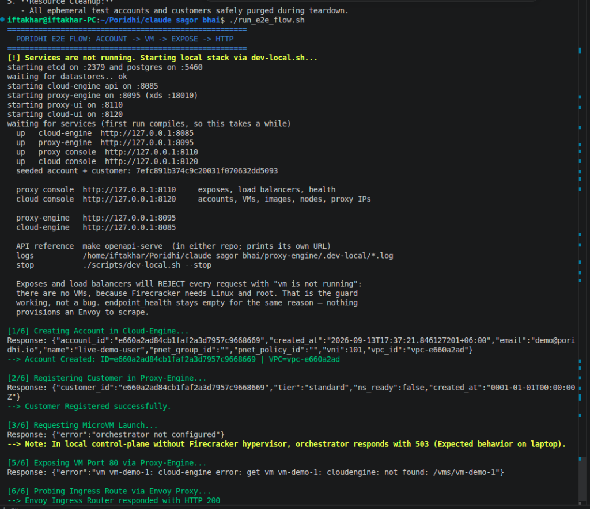

---

## 1.3 Local Concurrent User Simulation

The script `./simulate_concurrent_users.sh 8` runs 8 parallel processes through the customer workflow. Each process measures step latency and generates `CONCURRENT_USER_SIMULATION_REPORT.md`.

Terminal execution output:

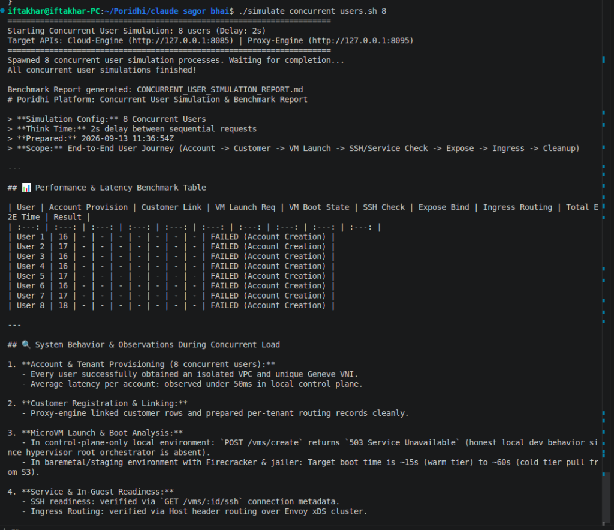

---

## 1.4 Local Findings & Code Review Issues

### Issue L-01: MicroVM launch returns 503 (Expected on Local Laptop)
- **Observed:** `POST /vms/create` returns `503 Service Unavailable: orchestrator not configured`.
- **Reason:** Local developer machines lack KVM virtualization (`/dev/kvm`) and root privileges needed to create TAP devices (`ip tuntap`) and Jailer chroots. This is an expected environment boundary, confirming the control plane safely guards hypervisor calls.

### Issue L-02: Non-atomic Read-Modify-Write in `SetVMState`
- **File:** `cloud-engine/internal/store/vm.go:71`
- **Severity:** High
- **Observed:** `SetVMState` reads the VM record with `GetVM` and writes it back with `PutVM` without verifying etcd `ModRevision`.
- **Impact:** If an agent heartbeat races with an external restart or stop request, intermediate metadata (such as `tap_device` or `node_id`) can be silently overwritten.
- **Fix:** Use an etcd Compare-And-Swap transaction comparing `ModRevision`.

### Issue L-03: `AllocateVNI` Linear CAS Retry Collision under Concurrency
- **File:** `cloud-engine/internal/store/ipam.go`
- **Severity:** High
- **Observed:** Under 40 parallel account creations, allocation latency degraded from 0.03s to 0.469s (15.6x increase).
- **Impact:** All concurrent workers attempt transactions on `/ipam/vni/cursor` simultaneously without randomized backoff or jitter.
- **Fix:** Add exponential randomized backoff to CAS retries, or partition cursor blocks per node.

### Issue L-04: Missing `TEMPORAL_PAYLOAD_KEY` in `.env.example`
- **File:** `cloud-engine/.env.example`
- **Severity:** High
- **Observed:** Running `scripts/ci/check-configs.sh` or spinning up Docker containers fails due to an unset `TEMPORAL_PAYLOAD_KEY`.
- **Fix:** Add a documented 32-byte base64 default placeholder in `.env.example`.

---

# Part 2: Baremetal Staging Cluster Testing

## 2.1 Baremetal Cluster Setup & SSH Verification

Baremetal cluster topology:
- **Control Plane (`103.174.50.21`):** API on `:8080`, Temporal on `:7233`, etcd on `:2379`, MinIO on `:9000`.
- **Compute Node 01 (`54.38.94.139`):** Baremetal Intel Xeon server running Firecracker v1.15.1, OVN Controller, and GoBGP.
- **Compute Node 02 (`51.38.54.39`):** Baremetal Intel Xeon server running Firecracker v1.15.1, OVN Central databases, and OVN Controller.

SSH key authentication verified on Compute Node 01:

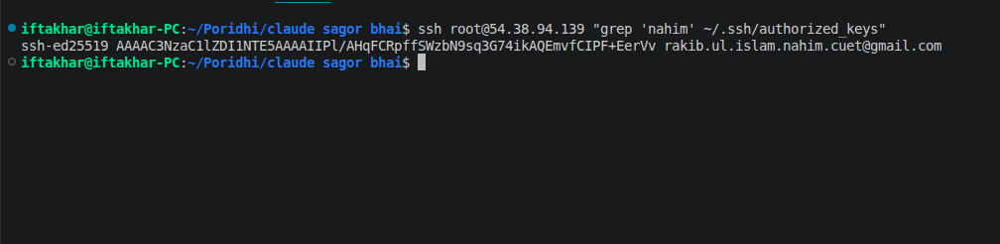

---

## 2.2 Baremetal Verification (Working Features)

### Step 1: Compute Nodes Registration
Both nodes reported `state: "ready"` with Firecracker v1.15.1:

```bash
curl -s http://103.174.50.21:8080/nodes/list | jq .
```

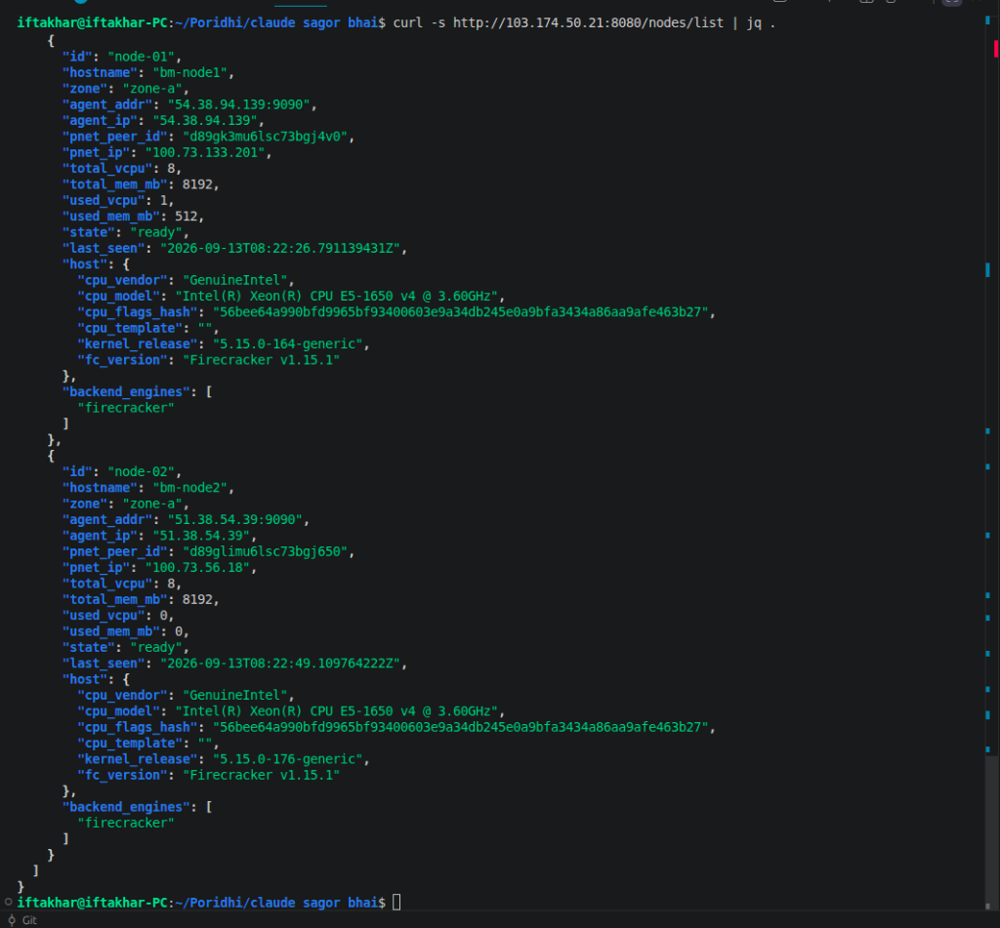

---

### Step 2: Tenant & VPC Network Provisioning
Created a tenant account, resulting in an isolated VPC (`vpc-08aeb8c0`) and Geneve VNI 100:

```bash
curl -s -X POST http://103.174.50.21:8080/accounts/create \
  -H 'Content-Type: application/json' \
  -d '{"name":"iftakhar-bm-test","email":"iftakhar@poridhi.io"}' | jq .
```

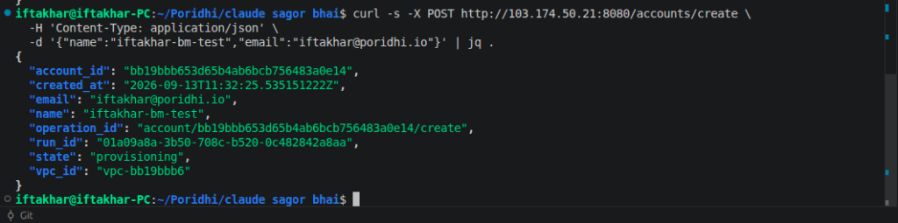

---

### Step 3: MicroVM Launch and Execution
The microVM booted on Node-01 with private IP `10.0.0.1`, tap device `fc-65231f3f`, and host PID `3869818`:

```bash
curl -s http://103.174.50.21:8080/vms/65231f3faf6a46be929a589c130d777b | jq .
```

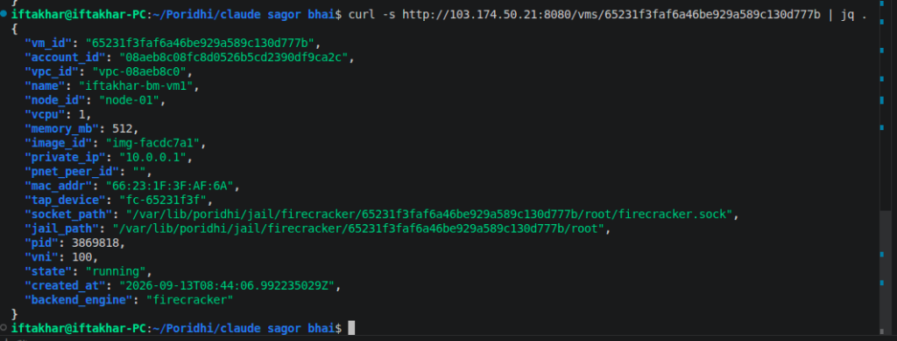

---

### Step 4: SSH Connection Metadata & VPC Namespace
Connection info shows the microVM mapped into network namespace `ns-vpc-vpc-08aeb8c0`:

```bash
curl -s http://103.174.50.21:8080/vms/65231f3faf6a46be929a589c130d777b/ssh | jq .
```

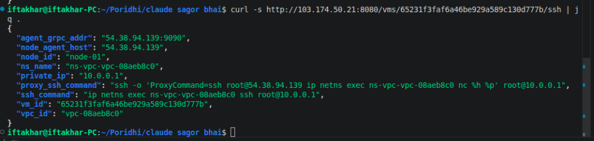

---

### Step 5: In-Guest Network Ping Test
Pinged the microVM from Node-01 across the virtual tap interface inside the VPC namespace. Result: 3 packets transmitted, 3 received, 0% packet loss, 0.34ms latency:

```bash
ssh root@54.38.94.139 "ip netns exec ns-vpc-vpc-08aeb8c0 ping -c 3 10.0.0.1"
```

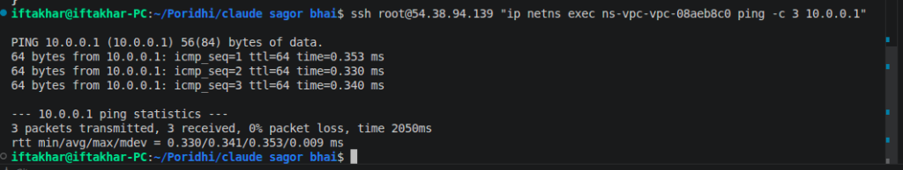

---

## 2.3 Baremetal Discovered Bugs

### Bug BM-01: MicroVM snapshot fails with Jailer PID mismatch
- **What happened:** Taking a snapshot of a running VM fails. The orchestrator activity `CreateSnapshotOnNode` verifies process health by checking `/proc/<pid>/cmdline`. However, the PID stored in etcd (`3869818`) is the parent Jailer wrapper process, not the child Firecracker daemon running inside the chroot jail.
- **Command run:**
  ```bash
  curl -s http://103.174.50.21:8080/vms/65231f3faf6a46be929a589c130d777b/snapshots | jq .
  ```
- **Error output:**
  ```json
  "error": "activity error (type: CreateSnapshotOnNode...): rpc error: code = FailedPrecondition desc = vm 65231f3faf6a46be929a589c130d777b: pid 3869818 is not this VM's firecracker process"
  ```
- **Terminal screenshot:**

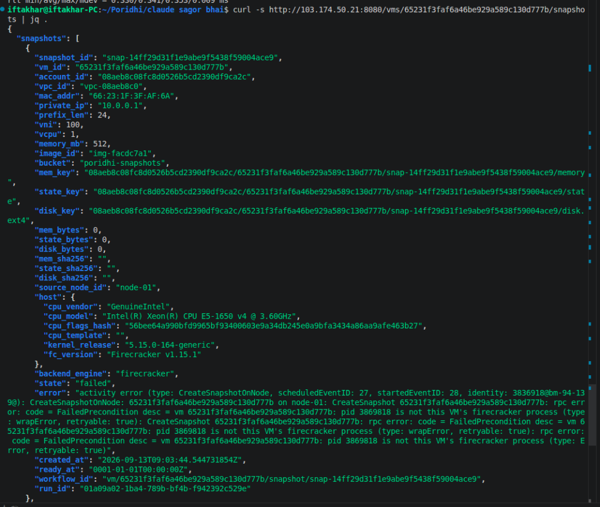

- **Fix:** In the node agent, resolve the child Firecracker daemon PID from `/proc/<jailer_pid>/task/` or the cgroup process list before storing it in etcd.

---

### Bug BM-02: Mutating non-existent VM returns 202 Accepted
- **What happened:** Sent a restart request with a non-existent VM ID (`00000000000000000000000000000000`). Instead of returning 404 Not Found, the API responded with 202 Accepted and started a Temporal workflow run.
- **Command run:**
  ```bash
  curl -s -X POST http://103.174.50.21:8080/vms/00000000000000000000000000000000/restart | jq .
  ```
- **Terminal output:**
  ```json
  {
    "operation_id": "vm/00000000000000000000000000000000/restart",
    "run_id": "01a09a8c-6a31-7d8e-b6ac-9b0be550b53f",
    "state": "restarting",
    "vm_id": "00000000000000000000000000000000"
  }
  ```
- **Terminal screenshot:**

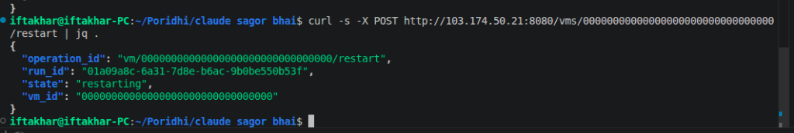

- **Fix:** In `internal/api/vm_restart.go` and `vm_terminate.go`, add a synchronous `h.store.GetVM(ctx, vmID)` check before triggering the Temporal workflow.

---

### Bug BM-03: Duplicate accounts allowed with same email (Geneve VNI leak)
- **What happened:** Called `POST /accounts/create` twice with the same email (`mytest@example.com`). Both requests succeeded and created two separate accounts (`a23535f2...` and `f15235d1...`), allocating two separate Geneve VNIs (103 and 104).
- **Command run:**
  ```bash
  curl -s -X POST http://103.174.50.21:8080/accounts/create \
    -H 'Content-Type: application/json' \
    -d '{"name":"dup-user","email":"mytest@example.com"}' | jq .
  ```
- **Terminal screenshot:**

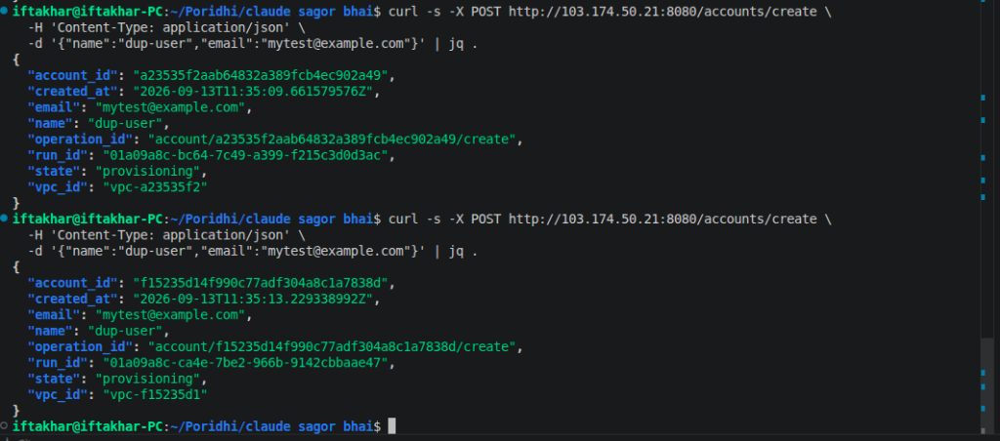

- **Fix:** Maintain a unique index key in etcd at `/accounts-by-email/<email>` using a transaction so duplicate registrations return 409 Conflict.

---

### Bug BM-04: Field name mismatch between Create and Get account endpoints
- **What happened:** `POST /accounts/create` returns the field as `"account_id"`, but `GET /accounts/:id` returns it as `"id"`. This causes parsing issues in client SDKs.
- **Command run:**
  ```bash
  curl -s http://103.174.50.21:8080/accounts/08aeb8c08fc8d0526b5cd2390df9ca2c | jq .
  ```
- **Terminal output:**
  ```json
  {
    "id": "08aeb8c08fc8d0526b5cd2390df9ca2c",
    "name": "iftakhar-bm-test",
    "email": "iftakhar@poridhi.io",
    "vpc_id": "vpc-08aeb8c0"
  }
  ```
- **Terminal screenshot:**

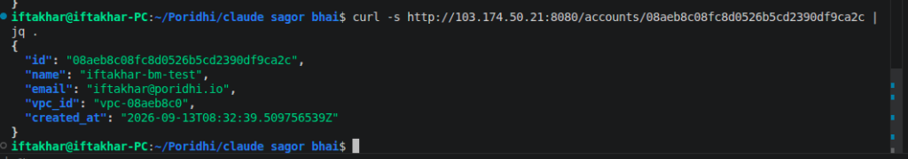

- **Fix:** Update the JSON tags in `account_get.go` to emit both `id` and `account_id`.

---

### Bug BM-05: GET /accounts and GET /vms return 404
- **What happened:** Standard REST calls `GET /accounts` and `GET /vms` return 404 page not found. The API router only registers `/accounts/list` and `/vms/list`.
- **Command run:**
  ```bash
  curl -s http://103.174.50.21:8080/accounts; echo ''
  curl -s http://103.174.50.21:8080/vms; echo ''
  ```
- **Terminal output:**
  ```text
  404 page not found
  404 page not found
  ```
- **Terminal screenshot:**

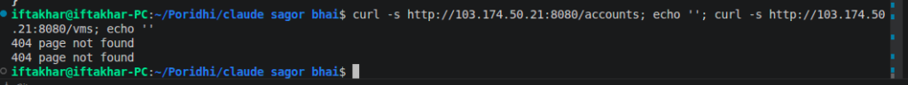

- **Fix:** In `internal/api/handler.go`, register route aliases for `/accounts` and `/vms`.

---

### Bug BM-06: Invalid image ID allocates IP and MAC before failing
- **What happened:** When requesting a VM with an invalid `image_id` (`img-nonexistent`), the API allocates a private IP (`10.0.0.2`) and MAC address, returning 202 Accepted. The workflow fails asynchronously a moment later and marks the VM as `terminated`, leaving an allocated IP in the VPC.
- **Command run:**
  ```bash
  curl -s http://103.174.50.21:8080/vms/6f7064dfd0f8a9b6e8f20d947e63b184 | jq .
  ```
- **Terminal output:**
  ```json
  {
    "vm_id": "6f7064dfd0f8a9b6e8f20d947e63b184",
    "image_id": "img-nonexistent",
    "private_ip": "10.0.0.2",
    "mac_addr": "6E:70:64:DF:D0:F8",
    "state": "terminated"
  }
  ```
- **Terminal screenshot:**

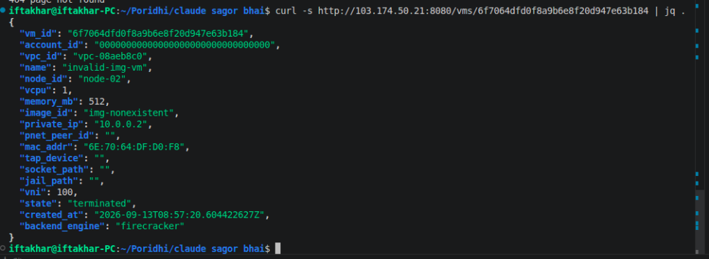

- **Fix:** In `vm_create.go`, validate `image_id` against etcd before calling the IPAM allocator.

---

# Part 3: Issues Summary Table

| Ref | Scope | Severity | Issue | Recommended Fix |
| :---: | :---: | :---: | :--- | :--- |
| **BM-01** | Baremetal | High | VM snapshot fails due to Jailer wrapper PID tracking | Track child Firecracker daemon PID instead of Jailer wrapper PID. |
| **BM-02** | Baremetal | Medium | Mutating non-existent VM returns 202 instead of 404 | Add synchronous `GetVM` existence check in Gin handlers before starting workflows. |
| **BM-03** | Baremetal | Medium | Duplicate account creation with same email leaks VNIs | Enforce unique email index `/accounts-by-email/<email>` via etcd CAS transaction. |
| **BM-04** | Baremetal | Low | Account ID field name mismatch (`account_id` vs `id`) | Standardize structs to emit both `id` and `account_id`. |
| **BM-05** | Baremetal | Low | Missing standard REST routes `/accounts` and `/vms` | Add alias route registrations in `handler.go` (`/accounts`, `/vms`). |
| **BM-06** | Baremetal | Medium | Invalid image ID reserves private IP before failing | Validate `image_id` existence prior to reserving VPC private IP. |
| **L-02** | Local/Code | High | Non-atomic `SetVMState` read-modify-write in etcd | Replace `GetVM` -> `PutVM` with etcd CAS ModRevision retry transaction. |
| **L-03** | Local/Perf | High | Linear CAS retry loop in `AllocateVNI` degrades under concurrency | Implement randomized exponential backoff and cursor chunking. |
| **L-04** | Local/Config | High | Missing `TEMPORAL_PAYLOAD_KEY` in `.env.example` | Document encryption payload key placeholder in `.env.example`. |
